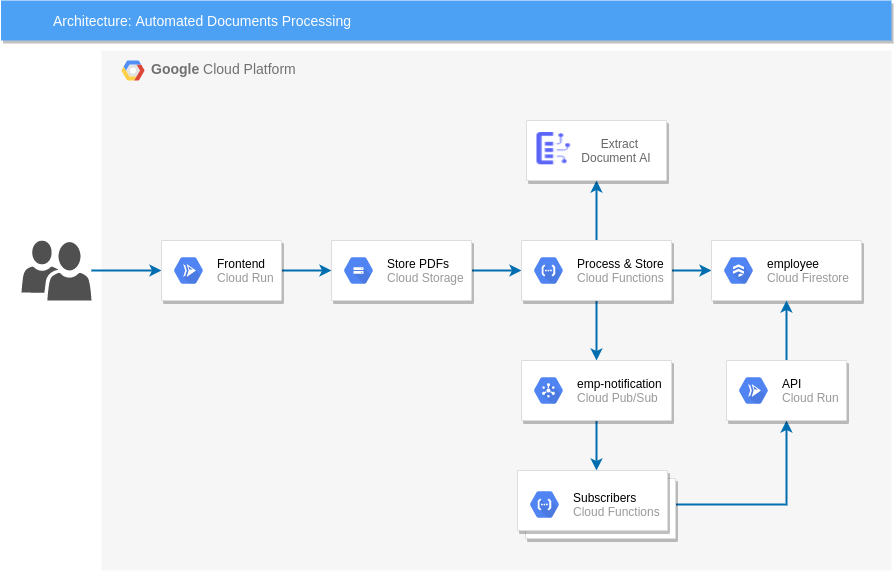

## DocumentAI-2026
Following components are used
* Document AI
* Pub/Sub
* Cloud Run functions
* Cloud Firestore
* Cloud Storage
* Cloud Run

### Create Service Account
1. Create Service Account
2. Assign the Editor Role.
3. Download the key and renamed it as terraform-key.json

### Create Config data in Firestore

1. Go to Firestore
2. Select Native Mode
3. Select a Location (e.g. United States)
4. Click on "Create Database"

### Create Infrastructure using Terraform
1. Create Project
2. Create SA, Assign the roles: Editor
and download key as terraform.json
3. export GOOGLE_CLOUD_KEYFILE_JSON=terraform-key.json
4. Copy `terraform/terraform.tfvars.example` to `terraform/terraform.tfvars` and set your variables (see `GCP-DEPLOY.md` for a full checklist).
5. terraform init
6. terraform plan
7. terraform apply

See `GCP-DEPLOY.md` for the deployment checklist and troubleshooting notes.
